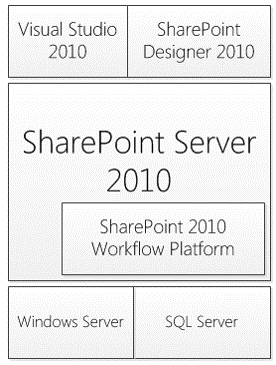
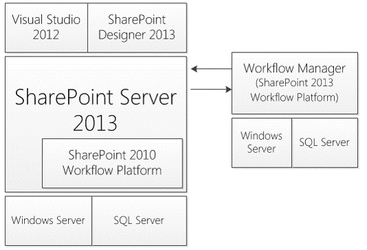
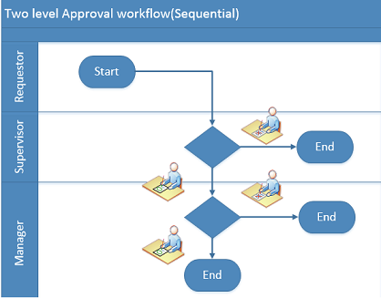
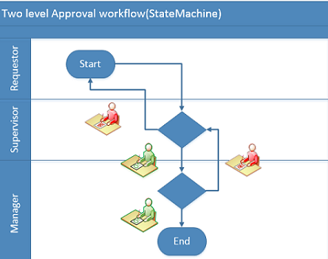

Overview
========
- [Goals and Challenges](#Goals-and-Challenges)
- [SharePoint 2013 Workflow architecture](#SharePoint-2013-Workflow-architecture)
- [Tools](#Tools)
- [Workflows Tasks and Outcomes](#Workflows-Tasks-and-Outcomes)
- [SharePoint 2013 REST API](#sharepoint-2013-rest-api)

Goals and
========== 
Challenges
===========
- SharePoint 2010
	- On-Premises focus
	- Full Trust extensions
	- Less Scalable
- SharePoint 2013
	- Cloud and  On-Premises
	- CSOM/REST
	- More Scalable

SharePoint 2013 Workflow 
========================
architecture
=============

Tools
=======
- SharePoint 2013 Designer
- Visio 2013
- Visual Studio 2013

 
Types of
========
Workflows
=========
- Sequential Workflows
- State Machine Workflws

Workflows Tasks and
===================
Outcomes
=========
- Pre SharePoint 2013 workflow using Task Content type

- In SharePoint 2013 
	- Workflow task(SharePoint 2013)
	- outcome and workflow instance id

Type of Tasks
-------------
- Single
	- SharePoint designer 2013
		- Assign a Task
	- Visual Studio 2013
		- Single Task
- Multiple
	- SharePoint designer 2013
		- Start a task process
	- Visual Studio 2013
		- Composite task

SharePoint 2013 REST API
========================
- Introduced with read/write support for lists in SharePoint 2010
  - `http://intranet.contoso.com/_layouts/ListData.svc`
- Dramatically expanded in SharePoint 2013 to support more than lists
- Based on [OData v3.0](http://www.odata.org/documentation/odata-version-3-0/) but contains some oddities & inconsistencies
- Code sample  
	- Get Users From SharePoint Group (https://github.com/devendrasv/WorkflowSamples-GetUsersFromSharePointGroup)

Demo Time... Let's Take a Look!
-------------------------------

#Resources
- MSDN/Technet
  - [Workflows in SharePoint 2013 MSDN/Technet](http://technet.microsoft.com/en-us/library/jj227177%28v=office.15%29.aspx)
- Workflow Team blog
  - [Workflow Team blog](http://blogs.msdn.com/b/workflowteam/)
- Workflow manager forum
  - [Workflow manager forum](https://social.msdn.microsoft.com/Forums/office/en-US/home?forum=wflmgr/)
- Andrew Connell Blog
  - [Andrew Connell Blog](http://andrewconnell.com/)

